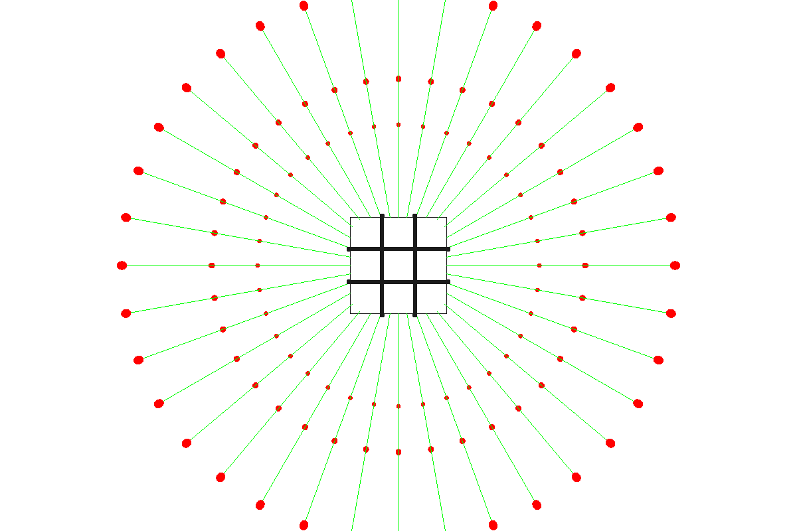
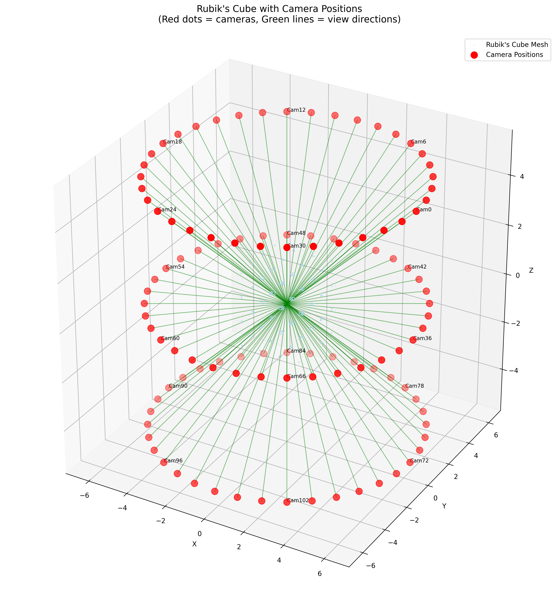
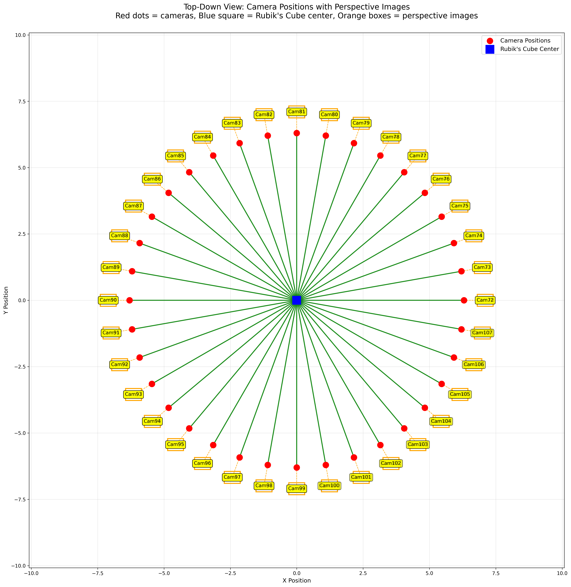
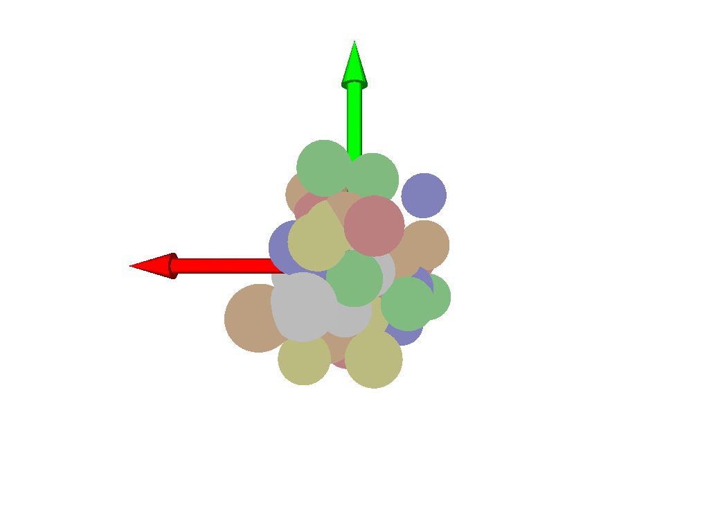
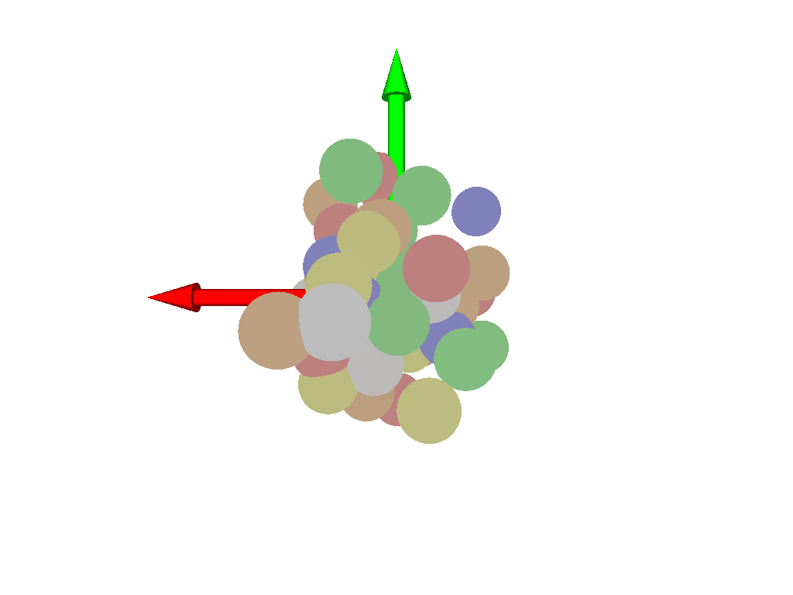
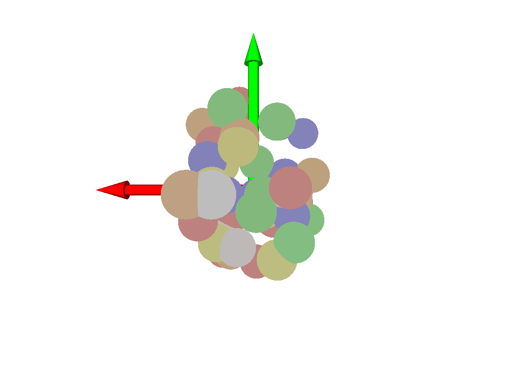

# Gaussian Splatting: From Theory to 54-Gaussian Optimization

Gaussian Splatting achieves real-time 3D reconstruction by representing scenes as explicit, learnable 3D Gaussian ellipsoids. To understand its bottlenecks, strengths, and practical constraints, I built a constrained, end-to-end optimization pipeline from scratch: training exactly 54 Gaussians to reconstruct a Rubik's cube from 108 multi-view RGB images.

This isn't just a toy problem. It's a controlled environment where every variable is known—ground truth geometry, perfect camera calibration, synthetic yet photorealistic rendering, and systematic multi-view coverage. These constraints unlocked insights into how Gaussian Splatting discovers 3D structure from 2D supervision alone.

---

## The Approach: Explicit 3D Proxies

Gaussian Splatting represents a scene as a set of learnable 3D Gaussian ellipsoids. Each Gaussian has:
- **Position** (learnable 3D center)
- **Covariance** (learnable shape and orientation)
- **Color** (learnable RGB)
- **Opacity** (learnable blending weight)

To render, you project all Gaussians into image space and blend them using alpha composition. This is fast (projection is cheap), interpretable (you can see the 3D geometry), and fully differentiable (positions and colors optimize end-to-end).

---

## Building the Pipeline: 108-View Rubik's Cube Dataset

### Why a Rubik's Cube?

The Rubik's cube is the ideal testbed: 54 distinct colored faces with sharp geometric boundaries, known ground truth geometry, complex viewing angles where most views show 2–3 faces simultaneously, and challenging feature density with bold colors and thin black separators. If Gaussian Splatting can reconstruct this, it can handle most multi-view scenarios.

### The 108-View Camera Architecture

I generated 108 precisely calibrated views using a systematic 3-level orbital camera rig with complete 360° coverage. Each camera position was computed to show 2–3 cube faces per view with consistent ambient lighting and sharp shadows.

**Multi-View Coverage Visualization:**


*Figure 1: 108 camera positions in orbital symmetry—the geometric foundation enabling view-consistent reconstruction.*


*Figure 2: Each 3D camera position maps to a unique 2D view. Gaussians must learn to render consistently across this entire view space.*


*Figure 3: Top-down view showing complete angular coverage with no blind spots—maximum information density for 3D learning.*

---

## Training: From Random Gaussians to Learned Geometry

### Architecture: 54 Trainable Gaussians

```python
class GaussianSplattingRubiks:
    def __init__(self, num_gaussians=54, device='cuda'):
        # Trainable Gaussian parameters
        self.positions = nn.Parameter(torch.randn(54, 3) * 0.1)    # 3D positions
        self.scales = nn.Parameter(torch.ones(54, 3) * 0.1)        # Ellipsoid scales
        self.rotations = nn.Parameter(torch.randn(54, 4))          # Quaternions
        self.colors = nn.Parameter(torch.rand(54, 3))              # RGB colors
        
        # Rubik's cube reference colors
        self.target_colors = torch.tensor([
            [1.0, 1.0, 1.0],    # White
            [1.0, 1.0, 0.0],    # Yellow  
            [1.0, 0.0, 0.0],    # Red
            [1.0, 0.5, 0.0],    # Orange
            [0.0, 0.0, 1.0],    # Blue
            [0.0, 1.0, 0.0],    # Green
        ])
```

### Training

I set up a standard training loop using an Adam optimizer, calculating the photometric MSE loss between the rendered views and ground-truth images, plus a light color consistency penalty.

### Training Evolution: Gaussian Self-Organization

Despite the flat loss, the most striking observation was that **Gaussians spontaneously organized into cube-like geometry.** Starting from random positions, the optimization discovered that clustering into face-aligned arrangements minimized photometric error. By epoch 7, a recognizable cube structure emerged—purely from 2D image supervision.





<video width="100%" controls style="margin: 20px 0;">
  <source src="../../public/assets/Gaussian Evolution.mp4" type="video/mp4">
  Your browser does not support the video tag.
</video>

*Complete 10-epoch training animation showing Gaussian position evolution and color refinement.*

---

## Ablation Studies

The baseline is stable and running. The next phase is systematic ablation to understand what drives convergence.

### Ablation 1: View Reduction at Each Level

**Approach:** Keep the same number of epochs (10), but systematically reduce the number of views per orbital level (top, normal, bottom). Start with full 36 views per level, then drop to 24, 12, 6, 3.

**Questions to answer:**
- What is the optimal number of views per level for stable convergence?
- Which view positions contribute most to optimization? Are angular views more critical than side views?
- Below what view count does the system become under-constrained and fail to organize geometry?

### Ablation 2: Gaussian Count Scaling

**Approach:** Fix the full 108-view setup, keep 10 epochs, but vary the number of Gaussians: 27, 54, 108, 216.

**Questions to answer:**
- Is there an optimal number of Gaussians for this scene?
- Does increasing Gaussian count improve convergence speed or just add redundancy?
- At what point does increasing Gaussians stop helping?

---

## What's Broken & What's Next

The baseline works—geometry self-organizes despite flat loss curves. But I don't know what the real constraints are. The ablation studies above will reveal:

- **View efficiency:** Can you get away with far fewer views and still learn geometry?
- **Gaussian efficiency:** What is the sweet spot of number of gaussians?
- **Critical perspectives:** Which camera angles matter most? Are corner views redundant?

Once these ablations finish, I'll have a much clearer picture of the sample efficiency and resource trade-offs. That'll feed into whether this approach is practical for real-world scenarios where you can't guarantee dense, calibrated multi-view data.

Next steps after ablations:
- Test with real-world RGB datasets and uncalibrated cameras
- Integrate COLMAP for automatic camera calibration
- Implement adaptive Gaussian pruning to reduce memory overhead
- Validate against published Gaussian Splatting benchmarks (3D-GS paper, official implementations)

---
